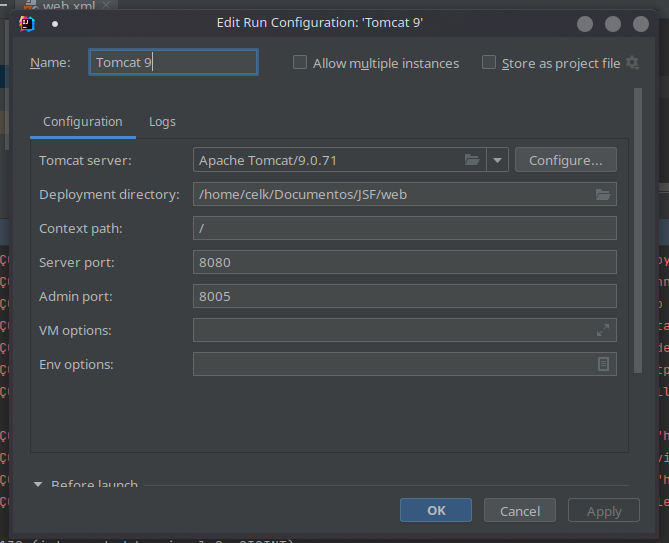

Projeto para testes do JSF com JPA e Hibernate

Setup do Tomcat no Intellij: 

https://www.youtube.com/watch?v=JIRDMGJ66SE

1. Baixar plugin Smart Tomcat
2. Criar Servidor com o Smart Tomcar
3. Apontar para o diretório onde o Tomcat 9 está extraído
4. Na aba deployments adicionar o Artifact: web exploded no build
5. Modificar o Path do context do Servidor
6. Tentar rodar

